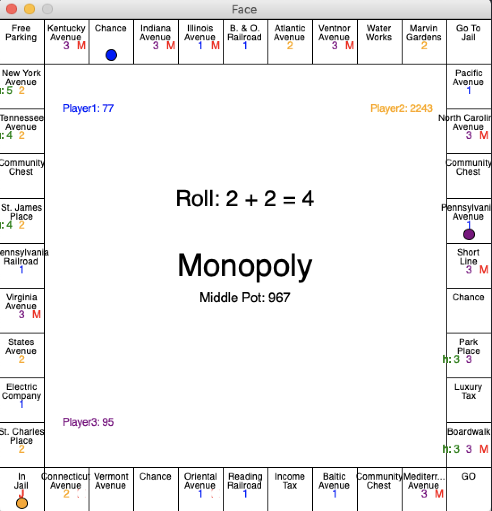
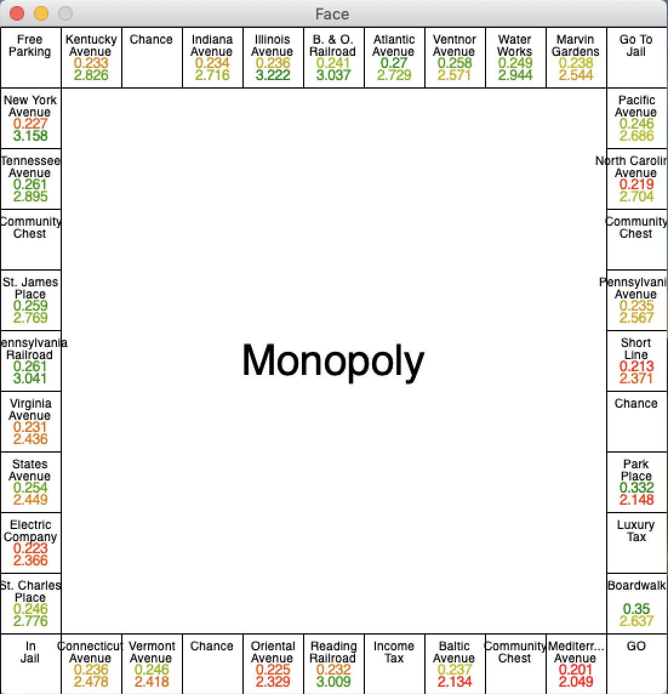

# Monopoly Probability
#### Created by Adiel Felsen

## Description
This is a python application used for analyzing the statistics of a monopoly game. This application can either be used for simulating a single game of monopoly or gathering data from thousands of simulated games.

## Modules
* This program uses [graphics](http://www.pas.rochester.edu/~rsarkis/csc161/python/pip-graphics.html) to display game board and data
* This program also uses [colour](https://pypi.org/project/colour/) to color code the data with a gradient

## Modes
There are two modes in which this application can be used:
1. Single Game Simulation: This mode simulates a game of monopoly turn by turn. The game board is displayed on the _graphics_ display and clicking the screen advances the game.
2. 10,000 Game Simulation: This simulates 10,000 games (but does not display changes to the game board). At the end, statistics are displayed on the game board.

## Changing modes, altering starting conditions:
* Certain parts of the code can be edited to change modes and the starting conditions of players. These parts are clearly indicated in the code, surrounded by # symbols. The values that can be altered are listed below.

  ############### Change this ##############

  code

  ##########################################

Line 82-92: Basics
  * numPlayers: The number of players in the game
  * turnByTurn: Set as "True" for a single game simulation. False for a 10,000 game analysis
  * turnSkip: During a single game, this determines how many turns are played after each mouse click

Line 207-219: Starting values
* playerMoneyList: The starting money for each player
* propertiesOwnedList: Properties owned for each player
* posList: The starting points for each player
* masterHousesList: The number of houses on each property
   * For example: masterHousesList[9] = 4 would put 4 houses on the ninth square (Connecticut Avenue)
* masterMortgageList: The number values of all mortgaged properties
* middlePot: The amount of money in the middle pot

## Explanation of symbols
1. Mode 1:
   * Circles: Represent the players
   * Colored numbers below property names: The player who owns the property
   * Red M on the bottom right of property names: Indicate that a property is mortgaged
   * Green number on the bottom left of property names: Indicate the number of houses on that property
   * Red "J" on "In Jail": Indicates whether a player is currently in jail (rather than "just visiting")
   * Center: Displays other gameplay information - player money, dice roll, middle pot, chance/community card values

2. Upon completion of 10000 games, game statistics are displayed:
   * Upper numbers: Represents the percent of winners who owned the property
   * Lower numbers: The percent of time each property is landed on
      * With slight alterations to the code, this can be changed to all squares, not just properties
      * This can also be replaced with the number of times a property is "lost" on by commenting and uncommenting portions of the code

## Rules that the players follow (in order):
Before roll
1. Unmortgaging: If the player has the money, try to unmortgage properties - prioritizing properties with houses
2. Houses: If the player has a monopoly and $200 more  than the cost of a house, try to build as many houses as possible

After Roll
1. Jail: If the player is in jail, try to get out in this order - get out of jail card --> pay $50 --> roll for doubles --> if player has rolled 3 times, automatic
2. Doubles 3 times: If the player rolled doubles three times, go to jail
3. Snake eyes: If the player rolled double 1s, get $100
4. Landing on go: Get extra $200
5. Landing on/passing go: Get $200
6. Landing on "Go to jail": Go to jail
7. Landing on "Free Parking": Get middle pot ($500 plus taxes payed to the middle)
8. Landing on "Chance" or "Community Chest": Follow instructions on the card
9. Buying properties: If the player has the money and lands on an unowned property, buy it
10. Paying rent: If the player lands on an already owned property, pay the rent
11. Paying taxes: If the player lands on a square that requires taxes, pay the taxes
12. Mortgaging: If the player has zero or negative money after paying, mortgage properties - prioritizing properties without houses
13. Losing: If the player has zero or negative money at the end of the turn, the player loses and properties are returned to the bank.
14. Winning: If there is only one player at the end of a turn, that player wins
15. Tying: If the game has been played for 1000 turns without a winner, the game is called as a draw

## Interesting Findings (so far)
* In a three person game without trades, about 50% of games end in a stalemate
* Starting out with the dark purple/brown monopoly and building on it immediately significantly reduces your odds of winning. The lack of money at the beginning is far worse than the slight benefit of the purple monopoly
  * However, starting with and building on any other monopoly is beneficial
* Properties that winners tend to have does not seem to directly correlate with the most landed on properties
* Boardwalk is the most common property owned by winners
* The dark purple/brown properties are least likely to be landed on and among the least common owned by winners

## Example

